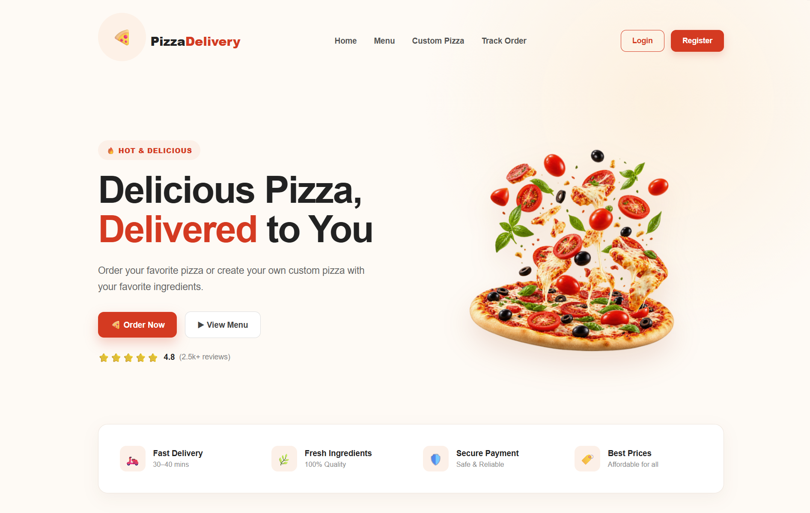
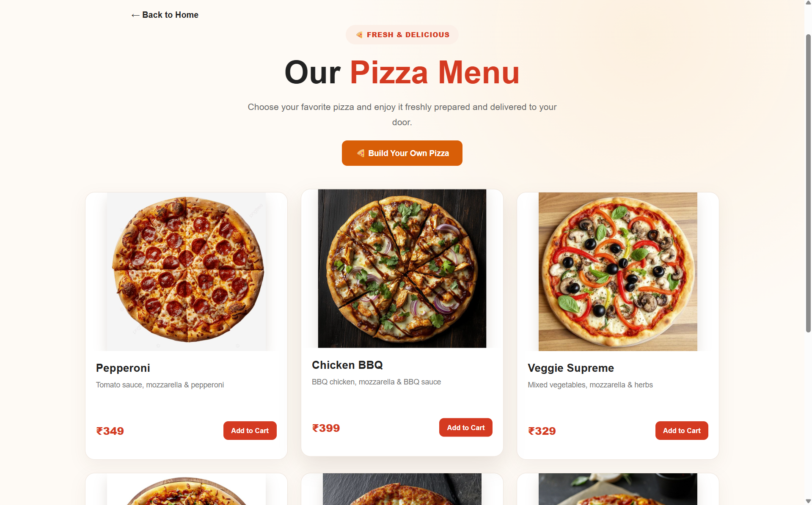
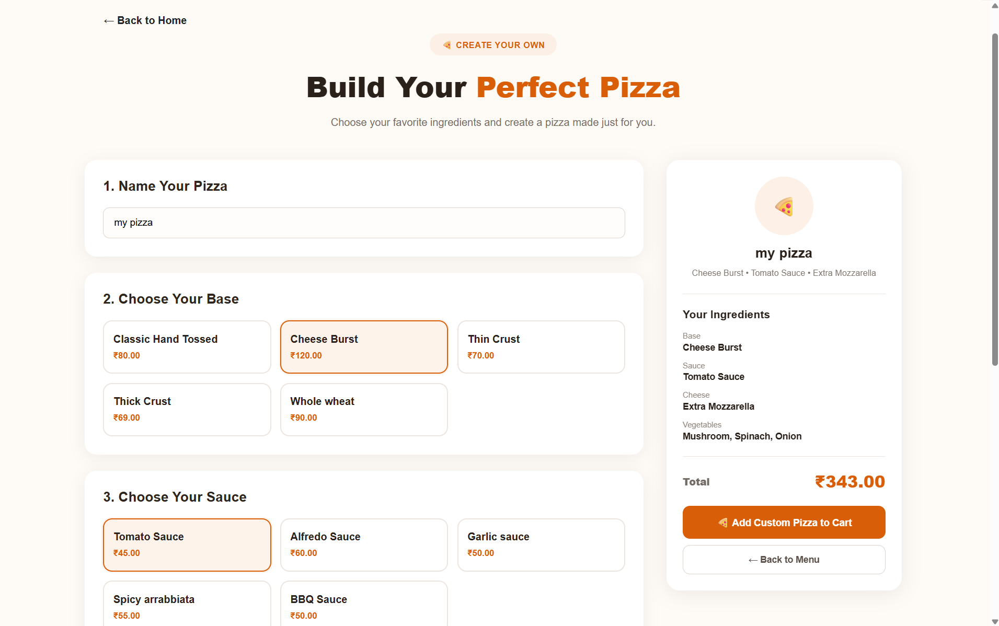
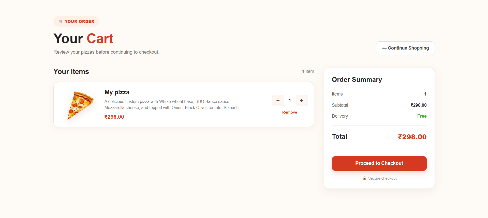
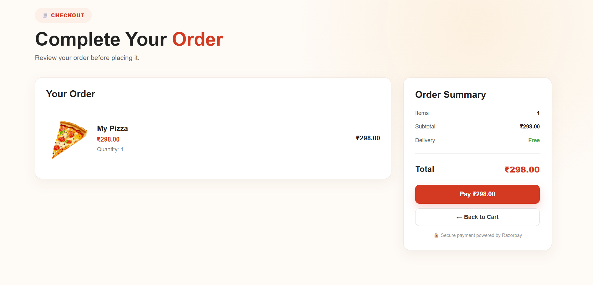
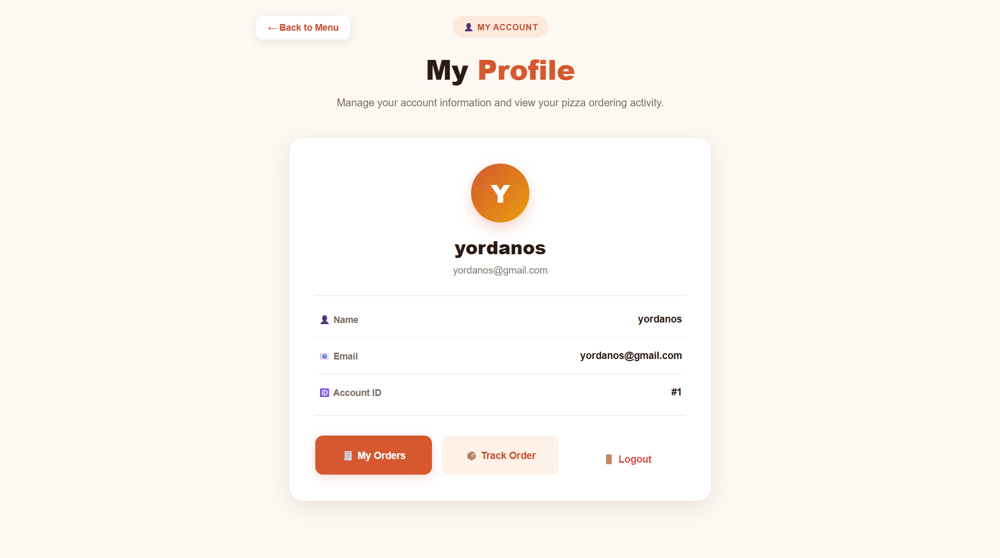
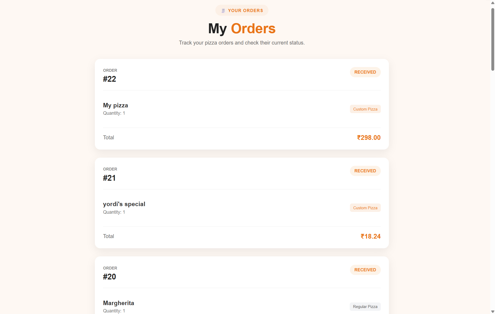
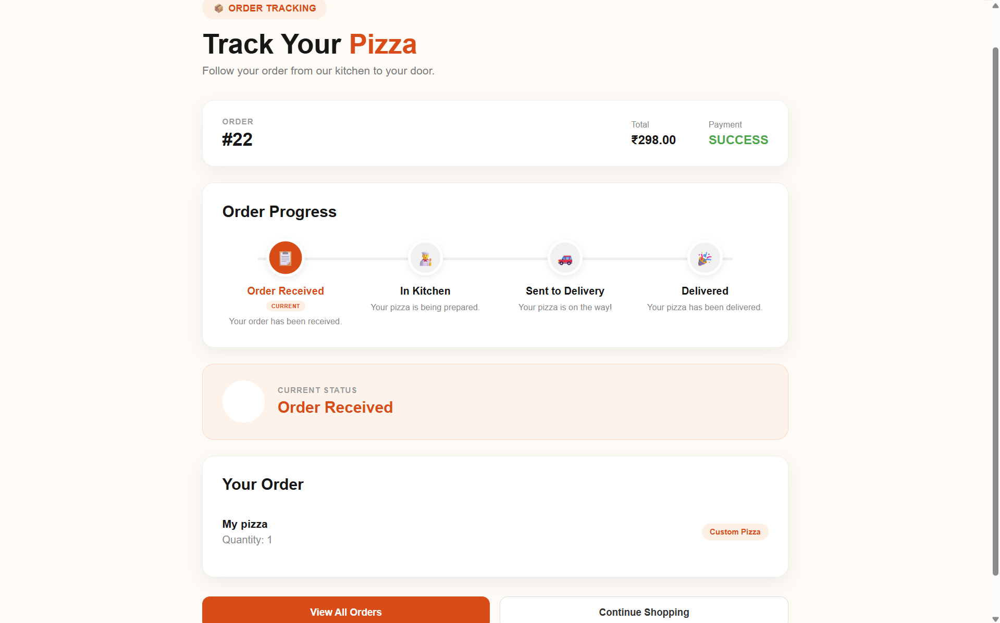
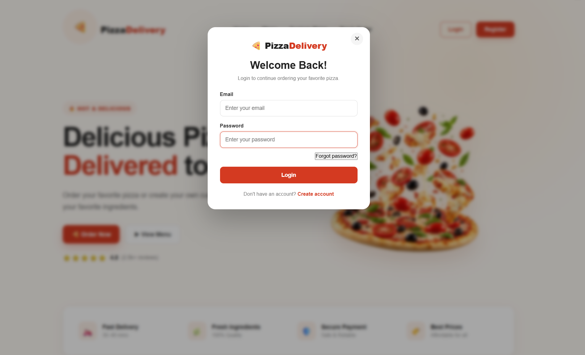
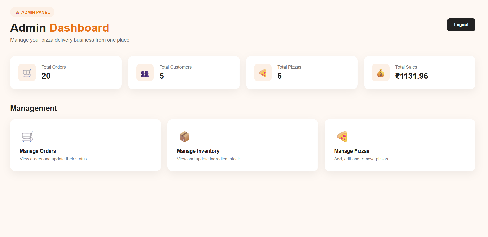

🍕 Pizza Delivery & Inventory Management System

A full-stack pizza ordering and inventory management application built with React.js, Node.js, Express.js, PostgreSQL, and Prisma.

The application supports customer ordering, custom pizza creation, cart and checkout, Razorpay test payments, order tracking, authentication, and administrative inventory management.

Project: Oasis Infobyte Web Development Internship — Level 3
Status: Completed
Purpose: Educational / Internship Project

🚀 Key Features

👤 Customer

User registration and login

JWT-based authentication and protected routes

Email verification and forgot-password flow

User profile

Pizza catalog and pizza details

Custom pizza builder

Shopping cart and checkout

Razorpay test-mode payment and payment verification

Order history and order status tracking

Logout

👨‍💼 Admin

Separate admin access

Admin dashboard

Pizza CRUD operations

Pizza base, sauce, cheese, and vegetable management

Inventory monitoring and manual updates

Low-stock monitoring

Order status management

Automatic stock deduction when orders are created

🛠️ Tech Stack

Layer

Technologies

Frontend

React.js, React Router, JavaScript, HTML5, CSS3

Backend

Node.js, Express.js, REST APIs

Database

PostgreSQL

ORM

Prisma

Authentication

JWT

Payment

Razorpay Test Mode

API Testing

Postman

Version Control

Git, GitHub

🏗️ Architecture

React Frontend
      ↓ HTTP / REST API
Node.js + Express Backend
      ↓ Prisma ORM
PostgreSQL Database

🍕 Custom Pizza Builder

Customers can create a custom pizza by selecting a base, sauce, cheese, and multiple vegetables. The backend calculates the custom pizza price from the selected ingredients and stores the resulting custom pizza.

📦 Inventory Management

Inventory is managed for pizza bases, sauces, cheese, vegetables, and pizza stock. The system validates stock during order processing and reduces the corresponding inventory quantities when orders are created. Database transactions are used when updating multiple inventory records to help maintain consistent stock data.

🔐 Authentication & Authorization

Authentication uses JSON Web Tokens (JWT). After login, the backend generates a token, protected requests send it through the Authorization: Bearer <token> header, and backend middleware verifies the token before allowing access to protected resources.

🛒 Order Flow

Browse Menu
    ↓
Select Pizza / Build Custom Pizza
    ↓
Add to Cart
    ↓
Review Cart
    ↓
Checkout
    ↓
Create Order
    ↓
Razorpay Test Payment
    ↓
Payment Verification
    ↓
Order Confirmed
    ↓
Track Order

Order Status

ORDER RECEIVED → IN KITCHEN → SENT TO DELIVERY → DELIVERED

The tracking page periodically requests the latest order information from the backend.

💳 Payment Integration

The project integrates Razorpay Test Mode. The backend creates the payment order and verifies the payment response before the order is treated as successful.

Note: Razorpay is configured for test/development purposes. No real financial transaction is intended through this project.

🗄️ Database

The application uses PostgreSQL with Prisma ORM.

Main models include:

User
Pizza
PizzaBase
Sauce
Cheese
Vegetable
CustomPizza
Order
OrderItem
Payment

📁 Project Structure

WebDev-L3-PizzaDelivery/
├── client/
│   ├── src/
│   │   ├── components/
│   │   ├── pages/
│   │   ├── styles/
│   │   └── assets/
│   └── package.json
│
├── backend/
│   ├── controller/
│   ├── routes/
│   ├── middleware/
│   ├── prisma/
│   │   └── schema.prisma
│   ├── config/
│   ├── server.js
│   └── package.json
│
├── screenshots/
└── README.md

📸 Screenshots

🏠 Home Page

🍕 Pizza Menu

🛠️ Custom Pizza Builder

🛒 Shopping Cart

💳 Checkout

👤 User Profile

📦 My Orders

🚚 Order Tracking

🔐 Login

⚙️ Admin Dashboard

⚙️ Installation & Setup

1. Clone the repository

git clone https://github.com/gelu1243-max/OIBSIP.git
cd WebDev-L3-PizzaDelivery

2. Backend

cd backend
npm install

Create a .env file:

DATABASE_URL="your_postgresql_database_url"
JWT_SECRET="your_jwt_secret"
RAZORPAY_KEY_ID="your_razorpay_key_id"
RAZORPAY_KEY_SECRET="your_razorpay_key_secret"

Then:

npx prisma generate
npx prisma migrate dev
npm start

Backend:

http://localhost:5000

3. Frontend

In another terminal:

cd client
npm install
npm run dev

🧪 API Testing

Backend APIs were tested using Postman, including authentication, profiles, pizza and ingredient management, custom pizza creation, orders, payments, and admin operations.

🔒 Security & Data Integrity

The project includes:

JWT-based authentication

Protected backend routes

Authorization middleware

Environment variables for sensitive configuration

Server-side stock validation

Database transactions for inventory updates

Backend payment verification

📚 What I Practiced

Building full-stack applications with React and Node.js

Designing RESTful APIs

Developing Express.js backend services

Working with PostgreSQL and Prisma ORM

Designing relational database models

Implementing JWT authentication and protected routes

Building shopping cart and custom-product functionality

Integrating and verifying test-mode payments

Managing inventory and stock

Using database transactions

Building order management and tracking

Testing APIs with Postman

Using Git and GitHub

🔮 Future Improvements

WebSocket-based real-time order tracking

Online delivery address management

Additional payment methods

Customer reviews and ratings

Coupon and discount functionality

Advanced admin analytics

Improved mobile responsiveness

Order cancellation

Delivery personnel management

Production deployment

🎓 Internship Context

This project was developed as part of the Oasis Infobyte Web Development Internship — Level 3 and demonstrates practical experience across frontend development, backend API development, database design, authentication, payment integration, inventory management, and order management.

👩‍💻 Author

Gelila Abi Shewangizaw

GitHub: https://github.com/gelu1243-max

LinkedIn: https://www.linkedin.com/in/gelila-abi-b27b61403

⭐ Acknowledgements

Special thanks to Oasis Infobyte for the internship opportunity and project requirements that supported my practical experience in full-stack web development.